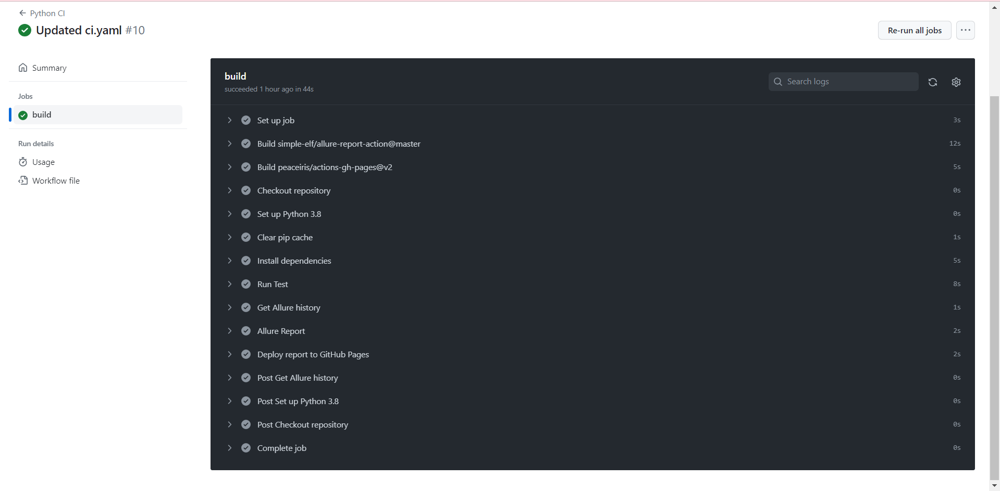
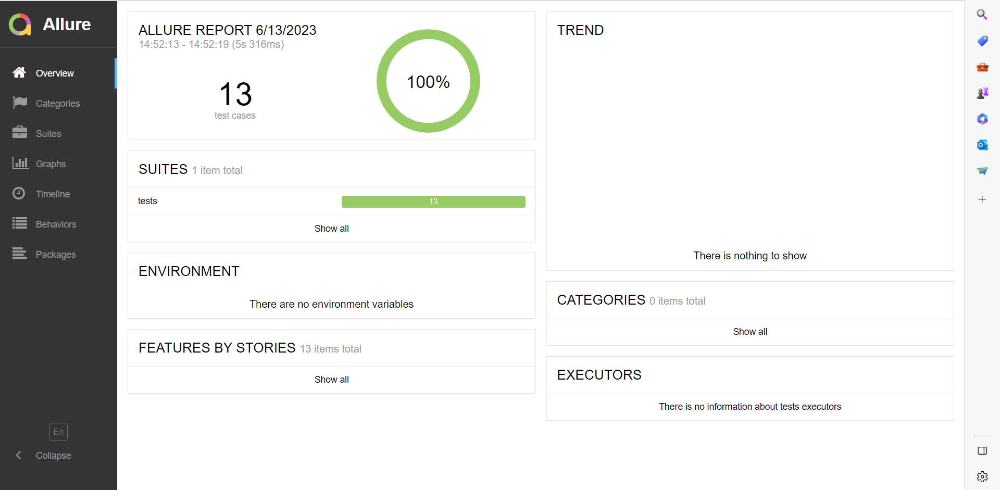

Final Task: API Testing using Python's requests library

Objective: Create tests for specific API endpoints of the REST API located at http://restapi.adequateshop.com/swagger/ui/index#. The API endpoints to be tested are:

1. POST /api/AuthAccount/Login
2. GET /api/Tourist/{id}

How To Install:
1. Clone the repo
2. Open the project directory
3. Create virtual env and activate
4. Install all packages that are in requirement.txt

Run tests:
1. Run tests with the command: `pytest --alluredir=allure-results`
2. Generate allure report with the command: `allure serve`

NOTE: Delete endpoints aren't working and expect failure of the tests that requires registering the user and registering the tourist:
test_successful_registration and test_get_tourist_by_id unless you change credentials.

CI/CD Pipelines:
[Run URL 
](https://github.com/megi1t/Final_Project_testing/actions/runs/5253908641/jobs/9491839161)

Allure report:

